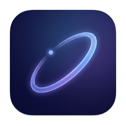
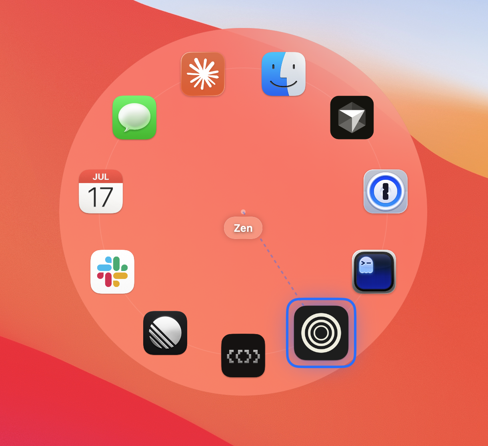

<p align="center">
  
</p>

# Orbit

A macOS radial app switcher inspired by Hitman's weapon wheel. Press a shortcut to summon a circle of running apps around your mouse cursor, hover to select, click to switch.


<p align="center">
  
</p>

## Features

- **Radial app switcher** — running apps arranged in a Hitman-style weapon wheel around your cursor
- **Multiple triggers** — keyboard shortcut, mouse button (middle / button 4 / button 5), or both at once
- **Mouse and trackpad modes** — trackpad mode has larger targets, bigger ring, and sticky selection
- **Pinned apps** — pin apps to fixed angles around the ring so muscle memory works regardless of which other apps are open
- **App filtering** — hide apps you don't want in the ring
- **Edge activation** — optional auto-switch when the cursor reaches the ring edge, no click needed
- **Scroll and arrow-key navigation** — two-finger swipe / scroll wheel rotates the highlight; Left/Right arrows + Enter also work
- **Smart browser suppression** — when triggered with a mouse button, Orbit detects links and tab bars in Safari/Chrome and suppresses the trigger so middle-click-to-open and middle-click-to-close still work
- **On-device dictation** - an opt-in dictation tile in the ring runs NVIDIA Parakeet TDT 0.6B v3 through [FluidAudio](https://github.com/FluidInference/FluidAudio) (CoreML) entirely locally; click the tile and speak into the focused field. Audio never leaves your Mac.
  - The spoken language is detected automatically across 25 European languages, with punctuation and capitalization
  - One model, downloaded on first use from Settings → Dictation
  - Floating "Listening…" indicator near the cursor; click or re-press the hotkey to commit, ESC to cancel
  - Pastes via `NSPasteboard` + synthesized `Cmd+V` so it works in Electron/Chromium apps (Cursor, VS Code, Slack, Discord, Notion)
  - Pasted text is marked transient so clipboard history managers (Maccy, Paste, Pastebot, Raycast, Alfred) skip the entries
- **Update checker** — checks GitHub Releases on launch and surfaces an "Update Available" item in the menu; manual "Check for Updates…" also available
- **Menu bar only** — no Dock icon, runs as `LSUIElement`

## How It Works

1. Press **Option+Space** (default) — a radial HUD appears at your mouse position
2. Move the mouse toward the app you want — it highlights with a glow
3. Click to switch — the selected app activates and the orbit dismisses
4. Press **ESC**, click outside, or press the shortcut again to dismiss without switching

## Install

```
git clone https://github.com/cfarvidson/app-switcher-orbit.git
cd app-switcher-orbit
xcodegen generate
open Orbit.xcodeproj
```

Build and run with **Cmd+R** in Xcode. On first launch, macOS will prompt for Accessibility permissions — grant them in **System Settings > Privacy & Security > Accessibility**.

Orbit runs as a menu bar app (no dock icon). Look for the dotted circle icon in your menu bar.

## Settings

Click the menu bar icon and select **Settings** (or **Cmd+,**).

### Shortcut

Choose between a keyboard shortcut or a mouse button:

- **Keyboard** — click Record and press your desired key combination (must include a modifier like Option, Cmd, Control, or Shift)
- **Mouse button** — choose Middle Button, Button 4 (Back), or Button 5 (Forward)

### App Filtering

Toggle apps on or off to control which ones appear in the orbit ring. Hidden apps are remembered across restarts.

## Build from Terminal

```
./build.sh
```

This builds a Release configuration and copies `Orbit.app` to the project root. You can then launch it with `open Orbit.app`.

To build manually without the script:

```
xcodebuild -project Orbit.xcodeproj -scheme Orbit -configuration Release build
```

The built app is in `~/Library/Developer/Xcode/DerivedData/Orbit-*/Build/Products/Release/Orbit.app`.

## Architecture

| Component         | File                         | Purpose                                                     |
| ----------------- | ---------------------------- | ----------------------------------------------------------- |
| Entry point       | `OrbitApp.swift`             | SwiftUI @main with NSApplicationDelegateAdaptor             |
| Orchestration     | `AppDelegate.swift`          | Menu bar, hotkey wiring, settings window, overlay lifecycle |
| Global hotkey     | `HotkeyService.swift`        | Carbon RegisterEventHotKey + NSEvent mouse monitors         |
| App detection     | `AppService.swift`           | NSWorkspace running GUI apps with exclusion filtering       |
| Overlay window    | `OverlayPanel.swift`         | Non-activating floating NSPanel with screen clamping        |
| State             | `OrbitViewModel.swift`       | Selection logic, angle math, ESC/click monitors             |
| Circular UI       | `OrbitView.swift`            | SwiftUI radial layout with hover tracking                   |
| App icon          | `AppIconView.swift`          | Icon with selection glow and scale animation                |
| Settings          | `SettingsService.swift`      | UserDefaults persistence for shortcuts and exclusions       |
| Settings UI       | `SettingsView.swift`         | Tab view for shortcut config and app filtering              |
| Shortcut recorder | `ShortcutRecorderView.swift` | Captures keyboard shortcut via NSEvent monitor              |
| Update checker    | `UpdateService.swift`        | Checks GitHub Releases for newer versions                   |
| Model             | `RunningApp.swift`           | Wraps NSRunningApplication                                  |

## Author

**Carl-Fredrik Arvidson**

- [carl-fredrik.arvidson.io](https://carl-fredrik.arvidson.io)
- [github.com/cfarvidson/app-switcher-orbit](https://github.com/cfarvidson/app-switcher-orbit)

## License

[GPL-3.0](LICENSE)
